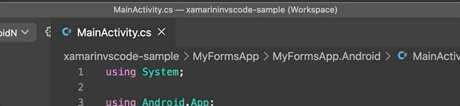
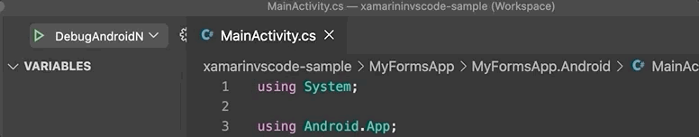

# Debug Xamarin.Android with VSCode.

I love VS 2019 and VSForMac, but sometimes you just want a really lite IDE. 
VSCode is that IDE. Its quick, easy to use and a very small download. As 
a member of the Xamarin.Android team, I also have to debug our product 
and test apps on Android. I've love to be able to use VS code to do just 
that. So lets see how we can make that happen :). 


## Get it Building

The first thing we need to do is to setup a new folder in our Solution
directory called `.vscode`. This is where we will put all our VSCode
related stuff. Next thing is to somehow get VSCode to build our application.
We can accomplish this using `tasks.json`. This is where we can put all 
the various build tasks that the IDE can run. 

We need to create a task which will call `msbuild` for our android project.
This is the basic template. 

```json
{
    // See https://go.microsoft.com/fwlink/?LinkId=733558
    // for the documentation about the tasks.json format
    "version": "2.0.0",
    "tasks": [
        {
            "label": "Build",
            "type": "shell",
            "command": "msbuild MyFormsApp/MyFormsApp.Android/MyFormsApp.Android.csproj /restore /t:Build /p:Configuration=Debug",
            "group": {
                "kind": "build",
                "isDefault": true
            },
            "problemMatcher": [
                "$msCompile"
            ]
        },
    ]
}
```

We added a new task called `Build`, this is a `shell` task which means it will drop
out to the terminal/command prompt when running this task. Most of the commands are 
just the defaults you need. For example the `problemMatcher` setting is what we need
to allow VSCode to pickup `msbuild` related warnings and errors. The important bits
are the `label` and `command`. The `label` is important because we will use it to 
build a dependency chain between tasks later on. So try to keep it simple.
The  `command` setting is where we put the command to do the build. As you can see we are
just calling `msbuild` for the project `MyFormsApp/MyFormsApp.Android/MyFormsApp.Android.csproj`.
This path is relative to the `root` of the solution folder, and it needs to be the path to 
the project you want to build. The rest of the arguments are for restoring nuget packages,
which `msbuild` target we want to call and which `Configuration` we want. In this
case we are just calling `Build` so the app will...build. If you place the above 
json in the `tasks.json` in your `.vscode` directory, you will then be able to use 
`Shift+Ctrl+P` to bring up a list of tasks. You will see a

```
Tasks: Run Build Task
```

option, hit enter and you will then be presented with a list of the build tasks
in the `tasks.json`. For now you will only see `Build`. Hit enter again and your 
app should build. If it doesn't work check the path to your `csproj` to make sure
it is correct.

## Picking a Configurtion

This is ok but there is one thing that would good to change. Currently we can only
build the `Debug` configuration as it is hardcoded. It would be nice to be able to
pick a configuration. Luckily VSCode allows us to dynamically add some inputs to the
task via the `inputs` section. This allows us to ask the user for input. In this case
we shall use the `pickString` input so the user can pick a value from a list. Here
is a sample

```json
"inputs": [
{
    "id": "configuration",
    "type": "pickString",
    "default": "Debug",
    "description": "The Build Configuration",
    "options": [ "Debug", "Release"]
}
]
```

This will present the user with a prompt where they can pick between `Debug` and `Release`.
We can then use that picked value in our build task by using `${input:configuration}`. So 
if we change the command to 

```
 "command": "msbuild MyFormsApp/MyFormsApp.Android/MyFormsApp.Android.csproj /restore /t:Build /p:Configuration=${input:configuration}",
```

When the user runs the task, it wil prompt for a configuration. Putting it all together we 
get this. 

```json
{
    // See https://go.microsoft.com/fwlink/?LinkId=733558
    // for the documentation about the tasks.json format
    "version": "2.0.0",
    "tasks": [
        {
            "label": "Build",
            "type": "shell",
            "command": "msbuild MyFormsApp/MyFormsApp.Android/MyFormsApp.Android.csproj /restore /t:Build /p:Configuration=${input:configuration}",
            "group": {
                "kind": "build",
                "isDefault": true
            },
            "problemMatcher": [
                "$msCompile"
            ]
        },
    ],
    "inputs": [
        {
            "id": "configuration",
            "type": "pickString",
            "default": "Debug",
            "description": "The Build Configuration",
            "options": [ "Debug", "Release"]
        }
    ]
}
```

## Installing and Running the app.

We have a `Build` task, but we also want to be able to install and run the app as well. 
To do that we need to add a few extra tasks. These will call different MSBuild targets,
namely `Install`, `Run`, and `Clean` (because we sometimes want to clean right :).
Lets look at the code for `Install` and `Clean`.

```json
{
    // See https://go.microsoft.com/fwlink/?LinkId=733558
    // for the documentation about the tasks.json format
    "version": "2.0.0",
    "tasks": [
        {
            "label": "Build",
            "type": "shell",
            "command": "msbuild MyFormsApp/MyFormsApp.Android/MyFormsApp.Android.csproj /restore /t:Build /p:Configuration=${input:configuration}",
            "group": {
                "kind": "build",
                "isDefault": true
            },
            "problemMatcher": [
                "$msCompile"
            ]
        },
        {
            "label": "Clean",
            "type": "shell",
            "command": "msbuild MyFormsApp/MyFormsApp.Android/MyFormsApp.Android.csproj /restore /t:Clean /p:Configuration=${input:configuration}",
            "group": {
                "kind": "build",
                "isDefault": true
            },
            "problemMatcher": [
                "$msCompile"
            ]
        },
        {
            "label": "Install",
            "type": "shell",
            "command": "msbuild MyFormsApp/MyFormsApp.Android/MyFormsApp.Android.csproj /restore /t:Install /p:Configuration=${input:configuration}",
            "group": {
                "kind": "build",
                "isDefault": true
            },
            "problemMatcher": [
                "$msCompile"
            ]
        },
    ],
    "inputs": [
        {
            "id": "configuration",
            "type": "pickString",
            "default": "Debug",
            "description": "The Build Configuration",
            "options": [ "Debug", "Release"]
        }
    ]
}
```

We added two more tasks. The only real difference between them is the `label` and which target 
they run. Other than that , they are identical to the `Build` task. The next thing we need
is the `Run` task. This is the one that will be responsible for starting the app on the device.
Lets look at this one in isolation first before we put in in with the others.

```json
{
    "label": "Run",
    "type": "shell",
    "command": "msbuild MyFormsApp/MyFormsApp.Android/MyFormsApp.Android.csproj /restore /t:_Run /p:AndroidAttachDebugger=true /p:Configuration=${input:configuration}",
    "group": {
        "kind": "build",
        "isDefault": true
    },
    "dependsOn": [
        "Install"
    ],
    "problemMatcher": [
        "$msCompile"
    ]
},
```

You can see we changed the `label` and the target which the command will run. We now call
`_Run`. This is a special target in Xamarin.Android, it is used to start the application 
on the device. Technically it is an internal target, but it has been there for many years :). 
The `_Run` target has an additional property which can be used to tell the runtime to wait
for a debugger. This is the `AndroidAttachDebugger` property. By passing `true` here , we are
telling the runtime on the device to wait for a debugger before continuing the app. This will
allow us to use the `launch.json` later to connect to the runtime and debug our app. 

The next change is the new `dependsOn` section. This is where we tell VSCode which other 
tasks this one needs to run first. Because the `_Run` target just runs the app, we need to 
make sure it is installed first. So by using `dependsOn` we can tell VSCode to run the 
`Install` task before running the `Run` tasks.

So here is the final `tasks.json`.

```json
{
    // See https://go.microsoft.com/fwlink/?LinkId=733558
    // for the documentation about the tasks.json format
    "version": "2.0.0",
    "tasks": [
        {
            "label": "Build",
            "type": "shell",
            "command": "msbuild MyFormsApp/MyFormsApp.Android/MyFormsApp.Android.csproj /restore /t:Build /p:Configuration=${input:configuration}",
            "group": {
                "kind": "build",
                "isDefault": true
            },
            "problemMatcher": [
                "$msCompile"
            ]
        },
        {
            "label": "Clean",
            "type": "shell",
            "command": "msbuild MyFormsApp/MyFormsApp.Android/MyFormsApp.Android.csproj /restore /t:Clean /p:Configuration=${input:configuration}",
            "group": {
                "kind": "build",
                "isDefault": true
            },
            "problemMatcher": [
                "$msCompile"
            ]
        },
        {
            "label": "Install",
            "type": "shell",
            "command": "msbuild MyFormsApp/MyFormsApp.Android/MyFormsApp.Android.csproj /restore /t:Install /p:Configuration=${input:configuration}",
            "group": {
                "kind": "build",
                "isDefault": true
            },
            "problemMatcher": [
                "$msCompile"
            ]
        },
        {
            "label": "Run",
            "type": "shell",
            "command": "msbuild MyFormsApp/MyFormsApp.Android/MyFormsApp.Android.csproj /restore /t:_Run /p:AndroidAttachDebugger=true /p:Configuration=${input:configuration}",
            "group": {
                "kind": "build",
                "isDefault": true
            },
            "dependsOn": [
                "Install"
            ],
            "problemMatcher": [
                "$msCompile"
            ]
        },
    ],
    "inputs": [
        {
            "id": "configuration",
            "type": "pickString",
            "default": "Debug",
            "description": "The Build Configuration",
            "options": [ "Debug", "Release"]
        }
    ]
}
```



## Attaching the Debugger

The final piece of this puzzle is to attach the debugger to the running app. 
We do this by adding a `launch.json` file to the `.vscode` directory. The 
code is very simple.

```json
{
    // Use IntelliSense to learn about possible attributes.
    // Hover to view descriptions of existing attributes.
    // For more information, visit: https://go.microsoft.com/fwlink/?linkid=830387
    "version": "0.2.0",
    "configurations": [
        {
            "name": "DebugAndroid",
            "type": "mono",
            "request": "attach",
            "address": "localhost",
            "port": 10000,
            "preLaunchTask": "Run",
        }
    ]
}
```

This is using the `mono` debug engine to attach to the runtime that is on the 
device. Looking at the code you can see that we are using `attach` to connect
to a `localhost` on `port` 10000. The mono SoftDebugger uses tcp to connect 
to the running process. However the process we want to attach to is on a device,
not the `localhost` so how does this work? 

Well we are using a feature of `adb` which lets us do port forwarding. This means
any traffic on the `localhost` on a particular port is forwarded on to the device
(or emulator) and the same goes for the traffic coming back. In this case the 
default debugging port that Xamarin.Android sets up in the `_Run` target is 10000.
It also automatically sets up the port forwarding for us. So we don't need to worry 
about it :). 

If you don't want to use the default port you can always change it to something else.
But if you change it in the `launch.json` you will also need to provide the msbuild properties
in the `Run` task in `tasks.json` which defines the port you want to use. The 
property names you need to change are `AndroidSdbTargetPort` and `AndroidSdbHostPort`.
The `AndroidSdbTargetPort` is the port which will be used on the device. The `AndroidSdbHostPort`
is the one that is opened on the PC. So if you have trouble using the default port
you can try adding these properties to change it. I'll leave that particular challenge
to you :)

One final thing to note is the `preLaunchTask`. This defines which `task` we should 
run before attempting to attach the debugger. In this case we run the `Run` task. 
As mentioned before this will run the app and wait for the debugger to attach. 
With all this in place, you should be able to hit the play button in VSCode and 
watch your app, build, install, run and then debug. 



## Conclusion

So with these tasks in place you should now be able to run and debug any Xamarin.Android
application in VSCode. This includes both normal Xamarin.Android and Xamarin.Forms based
ones. 

